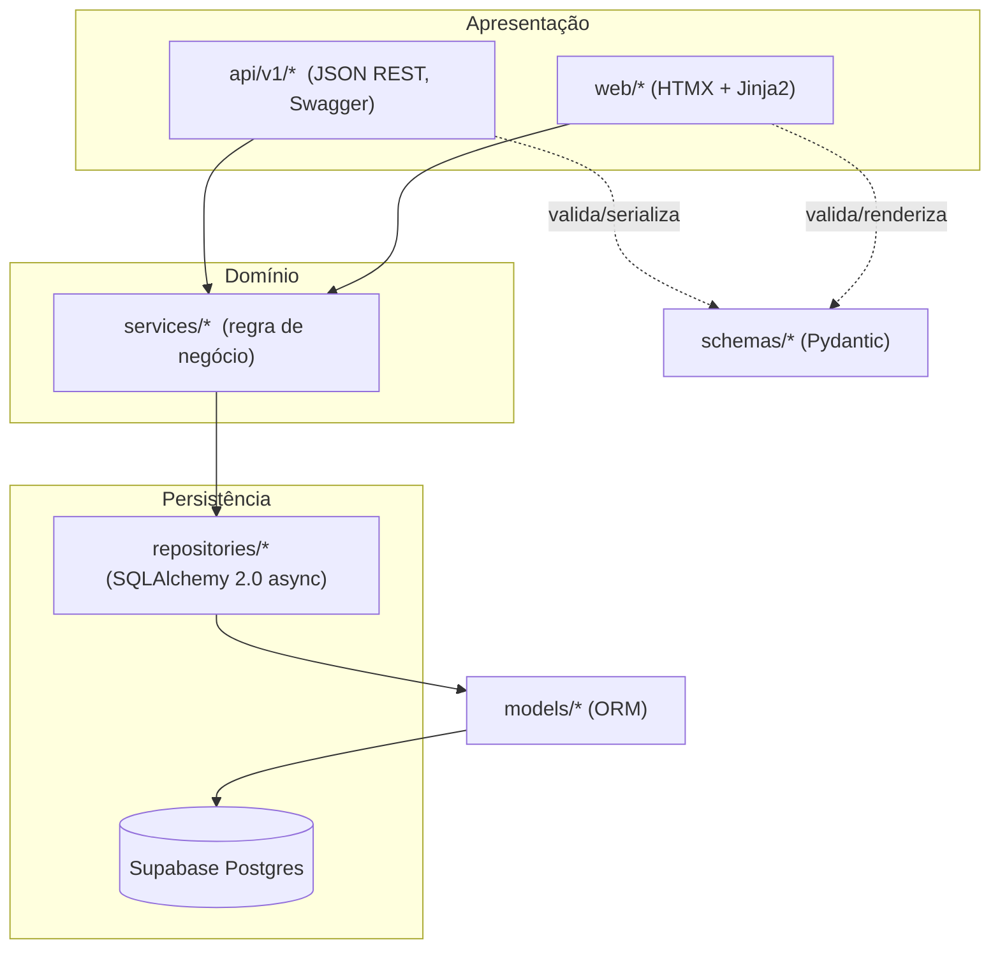

# Arquitetura

## Visão em camadas

Tríade segue Clean Architecture com Repository Pattern e Service Layer,
compartilhados entre a API JSON e as páginas server-rendered:



Por que essa divisão: `api/` e `web/` nunca acessam repositories diretamente —
ambas chamam a mesma service layer, evitando duplicar regra de negócio (ex.:
detecção de conflito de horário na Agenda, ou a lógica de "completar tarefa"
usada tanto pelo botão HTMX quanto pelo endpoint JSON).

## Autenticação

O Supabase Auth (GoTrue) é o único provedor de identidade — cuida de
signup/login por e-mail e senha, confirmação por e-mail, redefinição de senha
e OAuth (Google/GitHub). O FastAPI nunca reimplementa essas regras; ele:

1. Fala com a Auth REST API do Supabase via `app/auth/supabase_client.py`
   (login, signup, refresh, OAuth authorize URL, recuperação de senha).
2. Guarda `access_token`/`refresh_token` em cookies **httpOnly** (nunca
   expostos ao JavaScript) — `app/auth/session.py`.
3. Valida o JWT (HS256, `SUPABASE_JWT_SECRET`) a cada requisição —
   `app/auth/jwt.py`.
4. Sincroniza o perfil local (`users`, `user_settings`, quadro Kanban padrão)
   no primeiro request autenticado — `UserRepository.get_or_create`.

Fluxo OAuth: o Supabase redireciona de volta para `/auth/callback` com o token
no **fragmento** da URL (`#access_token=...`), que nunca chega ao servidor
automaticamente. Uma página-ponte lê o fragmento via JavaScript e o envia por
`POST /auth/callback/session`, que then define os cookies normalmente.

## CSRF

Formulários HTML/HTMX usam o padrão *double-submit cookie*: um cookie legível
por JavaScript (`triade_csrf`) mais um header (`X-CSRF-Token`, injetado
automaticamente pelo `app.js` em toda requisição HTMX) ou um campo oculto no
formulário. `app/auth/csrf.py` gera/valida o token; `app/templating.py`
expõe `render()`, que é a única forma correta de anexar esse cookie à resposta
(ver comentário no código — um `Response` injetado à parte no FastAPI **não**
tem seus cookies mesclados quando a rota retorna seu próprio objeto de
resposta).

A API JSON (`api/v1/*`) não usa esse mecanismo: ela é protegida pelo cookie de
sessão com `SameSite=Lax` (bloqueia envio em requisições cross-site que não
sejam navegação de topo) combinado com CORS restrito às origens configuradas.

## Banco de dados

- SQLAlchemy 2.0 com tipos cross-dialect (`Uuid`, `Enum(native_enum=False)`) —
  roda em Postgres (produção/Supabase) e SQLite (testes), sem duplicar models.
- Todas as tabelas têm `user_id` (FK) + índices, e todo repository filtra por
  usuário — nenhuma consulta cross-user é possível pela camada de serviço.
- Alembic gera as migrations a partir dos models; `scripts/supabase_schema.sql`
  é o espelho pronto para colar no SQL Editor do Supabase.

## Agenda, Kanban e Pomodoro

- **Agenda**: [FullCalendar](https://fullcalendar.io) (build vanilla JS, não
  React) consome `GET /api/v1/events` e emite `POST`/`PATCH` a cada
  criação/arraste/redimensionamento. Conflito de horário é calculado na
  service layer (`EventService.has_conflict`) e devolvido como aviso (não
  bloqueia a gravação).
- **Kanban**: HTML5 Drag and Drop nativo (`static/js/kanban.js`) chama
  `POST /api/v1/tasks/{id}/kanban-move` a cada solta.
- **Pomodoro**: cronômetro roda inteiramente no cliente (`static/js/pomodoro.js`);
  ao final de cada ciclo, `POST /api/v1/pomodoro/{id}/complete-cycle` grava um
  `TimeEntry` e atualiza `actual_duration_minutes` da tarefa vinculada.

## Estrutura de pastas

```text
src/app/
  main.py, config.py, database.py   # app factory, settings, engine
  api/v1/                           # rotas JSON REST (Swagger)
  web/                              # rotas HTMX/Jinja2
  services/                         # regra de negócio
  repositories/                     # acesso a dados (SQLAlchemy)
  models/                          # ORM (SQLAlchemy declarative)
  schemas/                         # Pydantic (request/response)
  auth/                             # Supabase Auth, JWT, sessão, CSRF
  templates/, static/               # Jinja2, CSS/JS/img
  utils/                            # paginação, datas, sanitização, logging
alembic/                            # migrations
scripts/supabase_schema.sql         # espelho SQL para o Supabase
tests/{unit,integration}/           # pytest
docs/                               # este site (MkDocs Material)
```

## Segurança e qualidade aplicadas

- **Sanitização**: descrição rica de tarefas passa por `bleach` antes de
  persistir (`utils/sanitize.py`), prevenindo XSS armazenado.
- **Rate limiting**: `slowapi` limita endpoints de autenticação
  (`RATE_LIMIT_AUTH`) e a aplicação como um todo (`RATE_LIMIT_DEFAULT`).
- **Auditoria**: `utils/logging.py` expõe `audit()` para eventos sensíveis
  (login, signup).
- **Paginação**: `utils/pagination.py` fornece `PageParams`/`Page` genéricos
  para listagens que crescem (uso preparado para os endpoints que hoje
  retornam listas completas, à medida que o volume de dados justificar).
